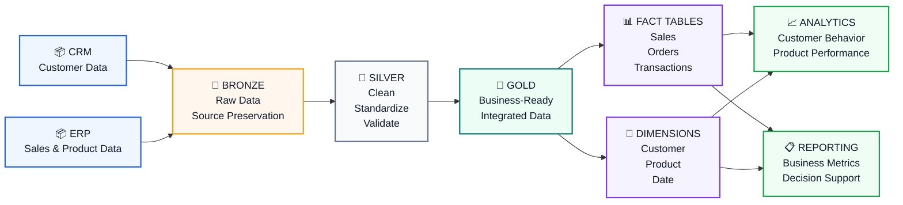

<!-- ========================================================= -->
<!-- HERO -->
<!-- ========================================================= -->

  

  <strong>⚙️ Data Engineering</strong>
  &nbsp;&nbsp;•&nbsp;&nbsp;
  <strong>🏗️ Data Platforms</strong>
  &nbsp;&nbsp;•&nbsp;&nbsp;
  <strong>📊 Analytics</strong>
  &nbsp;&nbsp;•&nbsp;&nbsp;
  <strong>🤖 AI/ML</strong>

 

 

---

# 👋 About Me

I'm a **B.Tech Artificial Intelligence & Data Science student** focused on **Data Engineering and Data Platform development**.

I build systems that transform **heterogeneous raw data into reliable, validated and analytics-ready datasets**.

My engineering approach follows:

### 📥 Ingest → 🧹 Transform → 🔍 Validate → 🧩 Model → 📊 Analyze

My core technical foundation includes **Python, SQL, PySpark, ETL/ELT, Data Warehousing, Data Lakehouse, Data Modeling and Data Quality**.

I also have experience in **AI/ML engineering**, giving me an additional perspective on how reliable data foundations support machine learning and intelligent applications.

### 🎯 Current Career Focus

I'm currently looking for:

**Data Engineer · Data Engineering Intern · Data Platform Engineer**

with an interest in building real-world data pipelines, analytical systems and scalable data infrastructure.

---

# 🧭 What I Build

<table>
<tr>

<td align="center" width="25%">

## 🔄

### Data Pipelines

ETL / ELT  
Batch Processing  
Transformation  
Validation

</td>

<td align="center" width="25%">

## 🏢

### Data Warehousing

Dimensional Modeling  
Star Schema  
Fact & Dimensions  
Analytics

</td>

<td align="center" width="25%">

## 🌊

### Data Platforms

Data Lakehouse  
Distributed Processing  
Cloud Data  
Data Quality

</td>

<td align="center" width="25%">

## 🤖

### AI / ML

Machine Learning  
Feature Engineering  
NLP  
Deep Learning

</td>

</tr>
</table>

---

# 🛠️ Technical Stack

## 🐍 Programming & Data Processing

<table>
<tr>

<td align="center" width="150">

 

<b>Python</b>

</td>

<td align="center" width="150">

 

<b>Java</b>

</td>

<td align="center" width="150">

 

<b>SQL</b>

</td>

<td align="center" width="150">

 

<b>PySpark</b>

</td>

</tr>

<tr>

<td align="center">

 

<b>Pandas</b>

</td>

<td align="center">

 

<b>NumPy</b>

</td>

<td align="center">

 

<b>Polars</b>

</td>

<td align="center">

🧠

 

<b>Feature Engineering</b>

</td>

</tr>

</table>

---

## 🏗️ Data Engineering

<table>
<tr>

<td align="center" width="170">

🔄

 

<b>ETL / ELT</b>

</td>

<td align="center" width="170">

🔗

 

<b>Data Pipelines</b>

</td>

<td align="center" width="170">

⚡

 

<b>Batch Processing</b>

</td>

<td align="center" width="170">

🏢

 

<b>Data Warehousing</b>

</td>

</tr>

<tr>

<td align="center">

🌊

 

<b>Data Lakehouse</b>

</td>

<td align="center">

🧩

 

<b>Data Modeling</b>

</td>

<td align="center">

⭐

 

<b>Star Schema</b>

</td>

<td align="center">

🔍

 

<b>Data Quality</b>

</td>

</tr>

<tr>

<td align="center">

✅

 

<b>Data Validation</b>

</td>

<td align="center">

🧹

 

<b>Data Cleaning</b>

</td>

<td align="center">

🔗

 

<b>Entity Resolution</b>

</td>

<td align="center">

🔁

 

<b>Incremental Processing</b>

</td>

</tr>

<tr>

<td align="center">

🔄

 

<b>CDC Concepts</b>

</td>

<td align="center">

📐

 

<b>Schema Standardization</b>

</td>

<td align="center">

🧪

 

<b>Analytical Validation</b>

</td>

<td align="center">

📊

 

<b>Data Transformation</b>

</td>

</tr>

</table>

---

## 🗄️ Databases & Cloud Platforms

<table>
<tr>

<td align="center" width="180">

 

<b>PostgreSQL</b>

</td>

<td align="center" width="180">

 

<b>MySQL</b>

</td>

<td align="center" width="180">

 

<b>Google Cloud</b>

</td>

</tr>
</table>

---

## ⚙️ Engineering & Infrastructure

<table>
<tr>

<td align="center" width="150">

 

<b>Docker</b>

</td>

<td align="center" width="150">

 

<b>Kubernetes</b>

</td>

<td align="center" width="150">

 

<b>Git</b>

</td>

<td align="center" width="150">

 

<b>GitHub</b>

</td>

<td align="center" width="150">

 

<b>Linux</b>

</td>

</tr>
</table>

---

## 🤖 AI / Machine Learning

<table>
<tr>

<td align="center" width="160">

 

<b>PyTorch</b>

</td>

<td align="center" width="160">

 

<b>Scikit-learn</b>

</td>

<td align="center" width="160">

📈

 

<b>XGBoost</b>

</td>

<td align="center" width="160">

🤗

 

<b>Transformers</b>

</td>

</tr>

<tr>

<td align="center">

🔧

 

<b>PEFT</b>

</td>

<td align="center">

⚡

 

<b>QLoRA</b>

</td>

<td align="center">

🧠

 

<b>LSTM</b>

</td>

<td align="center">

💬

 

<b>NLP</b>

</td>

</tr>

<tr>

<td align="center">

🧮

 

<b>Deep Learning</b>

</td>

<td align="center">

📊

 

<b>Model Evaluation</b>

</td>

<td align="center">

🧩

 

<b>Feature Engineering</b>

</td>

<td align="center">

🔬

 

<b>Statistical Modeling</b>

</td>

</tr>

</table>

---

## 💻 Software Engineering Foundations

`OOP`
&nbsp;•&nbsp;
`Data Structures & Algorithms`
&nbsp;•&nbsp;
`REST APIs`
&nbsp;•&nbsp;
`Backend Development`

 

`Debugging`
&nbsp;•&nbsp;
`Validation`
&nbsp;•&nbsp;
`SDLC`
&nbsp;•&nbsp;
`Testing`

---

# 💼 Experience

## ☁️ Cloud Intern — Accent Techno Soft

**June 2025**

Worked with **Google Cloud Platform (GCP)**, gaining practical exposure to cloud resource management, deployment workflows and cloud architecture.

### Key Contributions

- ☁️ Worked with GCP cloud resources
- 🚀 Gained practical exposure to deployment workflows
- 🔐 Configured and managed cloud resources
- 🛡️ Applied security policies and access-control practices
- 🏗️ Worked with cloud architecture concepts

---

## 🎨 Graphic Designer Intern — Visaithalam Solutions

**October 2023 — February 2024**

Delivered branding, marketing and visual-design assets across client projects.

### Key Contributions

- 🎨 Created branding and marketing assets
- 📋 Worked across multiple client projects
- ⏱️ Delivered work within project deadlines
- 💬 Incorporated stakeholder feedback into design iterations

---

# 🚀 Featured Projects

---

## 01 — 🏢 Enterprise Sales Data Warehouse

### End-to-End Data Engineering Platform

An end-to-end **SQL Server Data Warehouse** integrating heterogeneous **CRM and ERP datasets** into a centralized analytical platform using **T-SQL and Medallion Architecture**.

### 🏗️ Architecture

### 🔧 Engineering Work

- 🔗 Integrated heterogeneous CRM and ERP datasets
- 🥉 Designed the **Bronze** raw-data layer
- 🥈 Implemented cleansing, standardization, normalization and validation in the **Silver** layer
- 🥇 Developed a business-ready **Gold** layer
- 🧩 Implemented fact and dimension tables
- ⭐ Designed a **Star Schema**
- 🔄 Built reusable ETL and transformation workflows
- 🔍 Added data-quality validation checks
- 📊 Developed analytical outputs covering:
  - Customer behavior
  - Product performance
  - Sales trends
- 📚 Documented data architecture, data flow, data catalog and naming conventions
- 🔐 Maintained implementation in Git for reproducibility and version control

### 🧰 Technology

`SQL Server` · `T-SQL` · `ETL` · `Data Warehousing`

`Medallion Architecture` · `Dimensional Modeling` · `Star Schema`

`Data Quality` · `Data Validation` · `Git`

 

<a href="https://github.com/Niranjan-Murugarasu024/sql-datawarehouse-project">

### 🔗 View Project →

</a>

---

# 02 — 📊 DLMAI

## District-Level Market Attractiveness Index

### Reproducible Data Engineering & Analytical Pipeline

<table>

<tr>

<td align="center">

### 🌍 780+

Indian Districts

</td>

<td align="center">

### 🗂️ 6

Government Datasets

</td>

<td align="center">

### 🎲 3,000

Monte Carlo Tests

</td>

<td align="center">

### 📈 0.97

Mean Spearman ρ

</td>

</tr>

</table>

### 🔄 Data Pipeline

```mermaid
flowchart LR

    A["🗂️ Government<br/>Datasets"]

    B["📐 Schema<br/>Standardization"]

    C["🔗 Entity<br/>Resolution"]

    D["🗺️ District<br/>Crosswalk"]

    E["🩹 Missing Data<br/>Handling"]

    F["✅ Validation"]

    G["🧩 Feature<br/>Construction"]

    H["📊 Analytical<br/>Dataset"]

    I["📐 Quantitative<br/>Scoring"]


    A --> B
    B --> C
    C --> D
    D --> E
    E --> F
    F --> G
    G --> H
    H --> I


    classDef process fill:#F8FAFC,stroke:#0F766E,color:#111827,stroke-width:2px;

    class A,B,C,D,E,F,G,H,I process;
```

### 🔧 Engineering Work

- 🗂️ Integrated six heterogeneous government datasets
- 🌍 Processed data across **780+ Indian districts**
- 📐 Standardized inconsistent source schemas
- 🔗 Built district entity-resolution workflows
- 🗺️ Developed a district crosswalk
- 🔄 Handled historical district changes
- 🩹 Implemented missing-data handling
- ✅ Built automated validation workflows
- 🧩 Developed feature-construction pipelines
- 📊 Created standardized analytical datasets
- 📐 Developed a **7-pillar quantitative scoring model**
- 🎯 Applied AHP, entropy-based weighting and competitive-intensity adjustment
- 🎲 Evaluated ranking robustness across **3,000 Monte Carlo weight perturbations**

### 📈 Result

# **Mean Spearman ρ = 0.97**

### across ranking comparisons

### 🧰 Technology

`Python` · `Pandas` · `NumPy`

`Data Processing` · `Entity Resolution` · `Data Validation`

`Feature Engineering` · `Statistical Modeling`

---

# 🧠 Data Engineering × AI

<table>

<tr>

<td align="center" width="20%">

### 📥

Raw Data

</td>

<td align="center">

→

</td>

<td align="center" width="20%">

### ⚙️

Data Engineering

</td>

<td align="center">

→

</td>

<td align="center" width="20%">

### ✅

Trusted Data

</td>

<td align="center">

→

</td>

<td align="center" width="20%">

### 🤖

AI / Analytics

</td>

</tr>

</table>

My long-term technical direction sits at the intersection of **Data Engineering and AI Engineering**.

I want to build reliable data foundations that support:

- 📊 Analytics systems
- 🤖 Machine Learning
- 🧠 Intelligent applications
- 🔎 Data-driven decision systems
- 🏗️ Production AI infrastructure

---

# 📚 Currently Learning

<table>

<tr>
<th>Area</th>
<th>Current Focus</th>
</tr>

<tr>
<td>🐍 Python</td>
<td>Advanced data processing & engineering</td>
</tr>

<tr>
<td>🗄️ SQL</td>
<td>Advanced analytical SQL & optimization</td>
</tr>

<tr>
<td>⚡ PySpark</td>
<td>Distributed data processing</td>
</tr>

<tr>
<td>🌊 Data Lakehouse</td>
<td>Modern analytical architectures</td>
</tr>

<tr>
<td>🔥 Databricks</td>
<td>Data engineering platform</td>
</tr>

<tr>
<td>☁️ Cloud</td>
<td>Cloud data engineering</td>
</tr>

<tr>
<td>🔍 Data Quality</td>
<td>Validation & reliability</td>
</tr>

<tr>
<td>🧩 Data Modeling</td>
<td>Scalable analytical models</td>
</tr>

</table>

---

# 🎓 Education

## 🎓 B.Tech — Artificial Intelligence & Data Science

### Dr. N.G.P. Institute of Technology, Coimbatore

**2023 — 2027**

 

### CGPA

# **8.65 / 10**

---

# 🏅 Certifications

<table>

<tr>
<th>Certification</th>
<th>Organization</th>
<th>Year</th>
</tr>

<tr>
<td>🎯 AI Fluency Framework</td>
<td>Anthropic</td>
<td>2025</td>
</tr>

<tr>
<td>🔥 Generative AI Fundamentals</td>
<td>Databricks</td>
<td>2026</td>
</tr>

<tr>
<td>🧠 Elements of AI</td>
<td>University of Helsinki</td>
<td>2026</td>
</tr>

<tr>
<td>📊 GenAI Powered Data Analytics Job Simulation</td>
<td>Tata</td>
<td>2026</td>
</tr>

</table>

---

# 🌟 Beyond Engineering

## ✍️ The AI Edge

Author of the monthly LinkedIn newsletter **The AI Edge**, communicating developments in:

`Artificial Intelligence` · `Data` · `Emerging Technologies`

---

## 🎤 Research Presentation

Presented a research paper on an **AI-powered Healthcare Data Handling Platform** at **Coimbatore Institute of Technology (CIT)**.

---

## 🚀 Entrepreneurship

Participated in the **Illuminate Entrepreneurship Bootcamp** organized by **E-Cell, IIT Bombay**, focusing on:

`Innovation` · `Problem Solving` · `Product Ideation` · `Entrepreneurship`

---

# 📊 GitHub Analytics

  

---

# 🎯 What I'm Looking For

## 🚀 Data Engineering Opportunities

### Data Engineer
### Data Engineering Intern
### Data Platform Engineer

 

Interested in working on:

**🔄 Data Pipelines**
&nbsp;&nbsp;•&nbsp;&nbsp;
**🏢 Data Warehouses**
&nbsp;&nbsp;•&nbsp;&nbsp;
**🌊 Data Lakehouses**

 

**☁️ Cloud Data Engineering**
&nbsp;&nbsp;•&nbsp;&nbsp;
**🔍 Data Quality**
&nbsp;&nbsp;•&nbsp;&nbsp;
**📊 Analytics Infrastructure**

---

# 🤝 Let's Connect

## Building reliable data systems today.
## Building intelligent systems tomorrow.

