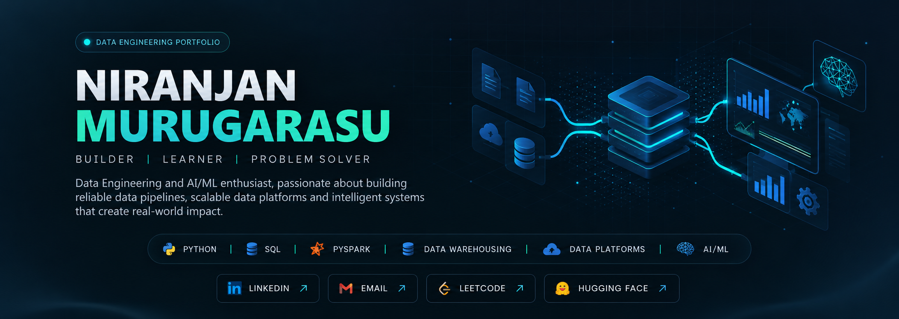

<div align="center">

<!-- ========================================================= -->
<!--                     HERO SECTION                          -->
<!-- ========================================================= -->



<br/>

<p>
  <strong>Data Engineering • Data Platforms • Analytics • AI/ML</strong>
</p>

<br/>

<a href="https://linkedin.com/in/niranjan-murugarasu-b8b706289">
  
</a>

<a href="mailto:niranjanmurugarasu@gmail.com">
  
</a>

<a href="https://leetcode.com/u/niranjanmurugarasu">
  
</a>

<a href="https://huggingface.co/BlueMen">
  
</a>

<br/><br/>


</div>

---

# 👋 About Me

I'm a **B.Tech Artificial Intelligence & Data Science student** focused on **Data Engineering and Data Platform development**.

I enjoy building systems that transform **raw, heterogeneous data into validated, structured and analytics-ready datasets**.

My primary engineering interests are:

- 🏗️ Data Engineering
- 🔄 ETL / ELT
- 🏢 Data Warehousing
- 🌊 Data Lakehouse Architecture
- 🧩 Data Modeling
- 🔍 Data Quality & Validation
- ⚡ Distributed Data Processing
- 📊 Analytics Engineering
- 🤖 AI/ML Data Foundations

My background in **AI/ML engineering** gives me an additional perspective on how reliable data infrastructure supports machine learning and intelligent applications.

### 🎯 Current Career Focus

**Data Engineer • Data Engineering Intern • Data Platform Engineer**

---

# 🧭 Engineering Focus

<div align="center">

```text
                         RAW DATA
                            │
                            ▼
                  ┌───────────────────┐
                  │     INGESTION     │
                  └─────────┬─────────┘
                            │
                            ▼
                  ┌───────────────────┐
                  │ STANDARDIZATION   │
                  └─────────┬─────────┘
                            │
                            ▼
                  ┌───────────────────┐
                  │   DATA QUALITY    │
                  │    & VALIDATION   │
                  └─────────┬─────────┘
                            │
                            ▼
                  ┌───────────────────┐
                  │  TRANSFORMATION   │
                  └─────────┬─────────┘
                            │
                            ▼
             ┌──────────────────────────────┐
             │     DATA WAREHOUSE /         │
             │        LAKEHOUSE             │
             └──────────────┬───────────────┘
                            │
                 ┌──────────┼──────────┐
                 ▼          ▼          ▼
             ANALYTICS    ML/AI     REPORTING
